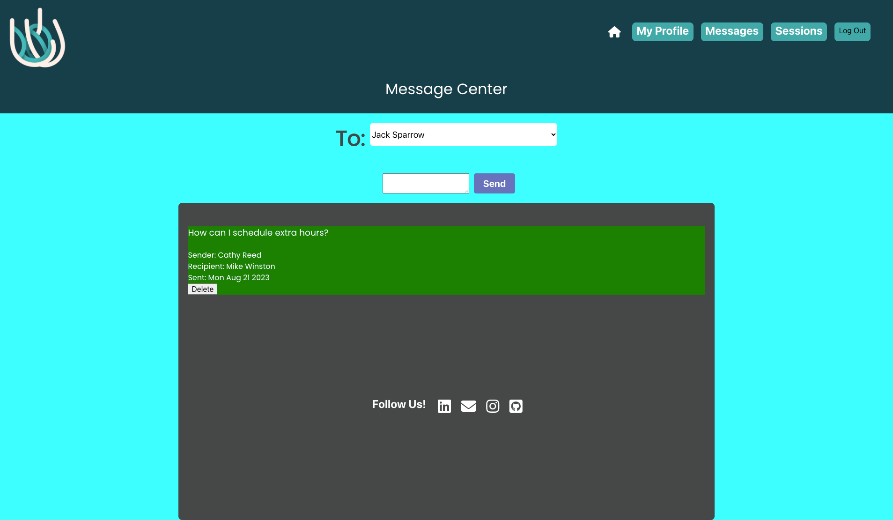
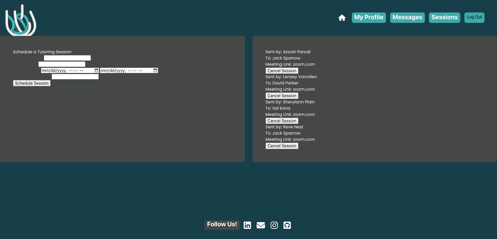

# Linguini Language Tutoring

## Table of Contents

[About the Project](#About-the-Project)
[Features](#Features)
[Technologies](#Technologies)
[Getting Started](#Getting-Started)
[Installation](#Installation)
[Usage](#Usage)
[Contact](#Contact)
[License](#License)
[Acknowledgements](#Acknowledgements)

### About the Project

Linguini Language Tutoring is a full-stack web application that enables language students to schedule tutoring sessions with registered tutors. The application is built using Express, MySQL, Sequelize, Node, Handlebars, and Passport.

### Features

Students: Students can create an account choose from a drop down bar listing language tutors to schedule a tutoring session with. They can also send messages to their tutors.

Tutors: Tutors can create an account and choose a language to provide class. They can also view a list of scheduled sessions on their Tutor Profile page and send messages to their students.

#### Home Page

The home page features a carousel showcasing top tutors and includes a header menu with Log In and Sign Up buttons.

#### Sign Up Page

Users can create an account as a tutor or student. Students can specify their preferred language and skill level.

#### Log In Page

Registered users can log in to access the website's features.

#### Tutor Profile Page

Tutors can view their photo, tutor rating, and a list of their current scheduled sessions.

#### Student Profile Page

Students can view their photo, personal details, and language of interest.

#### Messages Page

Both students and tutors can exchange text messages.

#### Scheduled Sessions Page

Students can schedule multiple tutoring sessions with registered tutors.

### Technologies

**Express**: Web application framework for Node.js
**MySQL**: Relational database management system
**Sequelize**: ORM for MySQL
**Node**: JavaScript runtime environment
**Passport**: Authentication library for Node
**Handlebars**: Templating language for dynamically generating HTML content

### Getting Started

### Installation

1. Clone the repository to your local machine:
   ```sh
   git clone https://github.com/MMerzoug/linguini-language-tutoring.git
   ```

2. Navigate to the project directory:
   ```sh
   cd linguini-language-tutoring
   ```

3. Install the required dependencies:
   ```sh
   npm install
   ```

### Usage

To use Linguini Language Tutoring:

1. Make sure you have completed the installation steps.
2. Run the application:
   ```sh
   npm start
   ```
3. Open your web browser and navigate to `http://localhost:3001` to access the application.
4. Sign up or log in to your account.
5. Explore available language tutoring sessions and choose one that suits your preferences.
6. Join a session, interact with your tutor, and engage in language learning activities.

For more information about the project and its features, please refer to the [project repository](https://github.com/MMerzoug/linguini-language-tutoring) and the project website at [https://pasta-fagioli-b817a8e5488d.herokuapp.com](https://pasta-fagioli-b817a8e5488d.herokuapp.com).

### Images
 
**Homepage**

 
**Sign-up page**

 
**Messages page**

 
**Scheduled Sessions page**


Linguini was created as part of the UC Berkeley Extension Coding Bootcamp curriculum by "Team #1", with members:

- Athena Wallis (wallisathena@gmail.com)
- Jesus Santos (jo_nez@hotmail.com)
- Monique Merzoug (monique.merzoug@icloud.com)
- Donahi Casas-Silva (donahi22@gmail.com)

### License

This project is licensed under the [MIT License](LICENSE).
[](https://opensource.org/licenses/MIT)

### Acknowledgements

With gratitude to the UC Berkeley Extension Bootcamp Teaching Assistants, Zoom video tutors, and engineer friends and relatives for their assistance and expertise throughout the course of the project. Special thanks to project consultant Robbert Wijtman and project tutor Robby Kurle.
```
